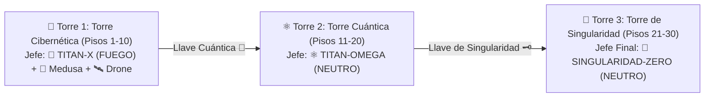

# 🤖 CYBER-ELEMENTAL: Documento de Especificación de Enemigos, Élites y Jefes

Este documento recopila la especificación técnica y de diseño de los **4 Grandes Élites Especiales**, los **Sirvientes Tácticos de Jefes**, los **8 Enemigos Regulares**, los **Jefes de Torre de Campaña** y las **Propuestas de Jefes Regionales**.

---

## 🌆 1. Estructura de Campaña: La Conquista de las 3 Torres

* **Torre 1: Torre Cibernética (Pisos 1 al 10):** Enemigos regulares (a mano limpia) y primeros encuentros Élite. En el Piso 10 te espera el combate 3v3 contra **TITAN-X (Fuego)** flanqueado por la **Ciber-Medusa (Agua)** y el **Drone Catalizador (Neutro)**. Otorga la *Llave Cuántica* 🔑 y un *Arma Legendaria* 👑.
* **Torre 2: Torre Cuántica (Pisos 11 al 20):** Escuadrones mixtos con enemigos armados y Élites reforzados. En el Piso 20 te espera **TITAN-OMEGA (Neutro)**. Otorga la *Llave de Singularidad* 🗝️ y un *Arma Legendaria* 👑.
* **Torre 3: Torre de Singularidad (Pisos 21 al 30):** Incursión de máxima hostilidad (100% enemigos armados). En el Piso 30 te espera el Jefe Final Supremo: **SINGULARIDAD-ZERO**.

---

## 💀 2. Los 4 Grandes Élites Especiales (Implementación Oficial)

Estos 4 enemigos representan las amenazas Élite de la torre, cada uno con mecánicas únicas de apertura y sinergias de alto impacto:

---

### 1. 🦍 COLOSO SÍSMICO (Élite de Tierra `🪨`)
* **Icono / Emoji:** `🦍`
* **Elemento:** `🪨` Tierra
* **Rol:** Tanque colosal / Control de Masas Total en Área.
* **Stats Base:** 250 HP, 20 ATQ, **SPD 3** (Muy Lento), Dodge 0%, Acc 95%, Crítico 15%.
* **Habilidades y Mecánicas:**
  * **⚔️ Impacto Tectónico (Ataque Normal - CD: 0):** Golpe demoledor de masa tectónica ($1.5\times$ de daño). Usado en Turno 1.
  * **💥 Terremoto Cataclísmico (Habilidad en Área - CD: 4, inicia en CD `currentCd: 4`):**
    * Se activa tras recargar sus turnos. Golpea a **todo el escuadrón** ($1.2\times$ de daño).
    * Aplica **`Aturdimiento (STUN)` garantizado durante 1 turno** a todos los robots golpeados.
    * Adhiere **3 `Marcas de Tierra`** a cada objetivo.

---

### 2. 👹 BERSERKER TÉRMICO (Élite de Fuego `🔥`)
* **Icono / Emoji:** `👹`
* **Elemento:** `🔥` Fuego
* **Rol:** Daño hiper-creciente / Amenaza crítica en agonía.
* **Stats Base:** 130 HP, 22 ATQ, SPD 12, Dodge 10%, Acc 100%, Crítico 15%.
* **Habilidades y Mecánicas:**
  * **🔥 Sobrecarga de Furia (Apertura T1 - CD 99, lista en inicio):** Sacrifica un 20% de su HP máximo en el primer turno para entrar de inmediato en *Furia Sobrecalentada*.
  * **🔥 Furia Sobrecalentada (Pasiva Continua):** Todo el porcentaje de vida perdida se convierte en Daño extra ($+1.25\%$ por cada 1% HP perdido) y Probabilidad de Crítico ($+0.60\%$ por cada 1% HP perdido).
  * **⚔️ Tajo Incandescente (Ataque Normal - CD: 0):** Ataque básico de fuego ($1.3\times$) que escala ferozmente con la pasiva.

---

### 3. 🥷 CYBER-STALKER (Élite de Aire `💨`)
* **Icono / Emoji:** `🥷`
* **Elemento:** `💨` Aire
* **Rol:** Asesino espectral / Evasión Absoluta y Golpe Demoledor.
* **Stats Base:** 75 HP, 24 ATQ, **SPD 22** (Supersónico), Dodge 40%, Acc 100%, Crítico 25%.
* **Habilidades y Mecánicas:**
  * **👻 Desfase Cuántico (Apertura T1 - CD 3, lista en inicio):** Eleva su Probabilidad de Esquiva al **100% durante 1 turno** (inmunidad total en la primera ronda).
  * **🗡️ Tajo Asesino (Ataque Normal - CD: 0):** Ataque quirúrgico demoledor ($2.0\times$ de daño) con **50% de penetración de defensas y barreras**.

---

### 4. 🧊 CRIO-CENTINELA (Élite Híbrido Agua/Aire `💦💨`)
* **Icono / Emoji:** `🧊`
* **Elemento:** `💦` Agua (Nativo) / `💨` Aire (Ofensivo)
* **Rol:** Controlador de Velocidad y Auto-Detonador de Combos.
* **Stats Base:** 170 HP, 17 ATQ, SPD 8, Dodge 5%, Acc 95%, Crítico 10%.
* **Habilidades y Mecánicas:**
  * **❄️ Ventisca de Cero Absoluto (Apertura T1 - CD 3, lista en inicio):** Golpea a **todo el escuadrón** ($0.85\times$ daño), reduce su velocidad al mínimo (**$\text{SPD} = 1$**) por 2 turnos y adhiere **3 Marcas de Agua**.
  * **💨 Ráfaga Gélida (Ataque Normal - Tipo Aire `💨`):** Ataque básico individual ($1.1\times$) clasificado como Aire. Al golpear a objetivos con Marca de Agua previa, **él mismo detona la Reacción de ¡VENTISCA!** ($1.35\times$ daño + Congelación `-20% Precisión`).

---

## 🪼 3. Sirvientes Tácticos de Jefes (Piso 10)

El combate contra TITAN-X se libra en formación 3v3 con dos unidades de soporte especializadas:

### 🪼 Ciber-Medusa (Soporte Ofensivo / Hostigadora)
* **Elemento:** `ELEMENTS.AGUA` (`💧`)
* **Stats Base:** 95 HP (~137 Nv10), ATQ 12 (~17 Nv10), **SPD 10**, Dodge 5%, Acc 95%, Crítico 5%.
* **Habilidades:**
  * `Salpicadura Corrosiva` (AoE, CD 3, lista en T1): 0.75x Daño a todo el escuadrón, aplica `Marca de Agua` (3T) y `Ralentización` (-50% VEL por 1 turno).
  * `Chorro de Hidro-Plasma` (Básico): 1.0x Daño + `Marca de Agua` (3T).
* **Rol:** Prepara el terreno mojando a todo el equipo para que TITAN-X detone masivos combos de **¡VAPOR!** ($1.6\times$ daño).

### 🛰️ Drone Catalizador (Soporte Defensivo / Buffer)
* **Elemento:** `ELEMENTS.NEUTRO` (`⚪`)
* **Stats Base:** 85 HP (~123 Nv10), ATQ 10 (~14 Nv10), **SPD 10**, Dodge 0%, Acc 100%, Crítico 0%.
* **Habilidades:**
  * `Matriz de Escudo Térmico` (CD 3, CD inic. 1): Proyecta un escudo de plasma (**20% HP Máx**) sobre TITAN-X y le otorga **Sobrealimentación Térmica** (`+20% ATQ` por 2 turnos).
  * `Láser de Fijación` (Básico): 0.9x Daño con 25% prob. de aplicar `Rompearmaduras` (-25% DEF por 2 turnos).

---

## 👑 4. Jefes de Campaña Implementados

1. **👹 TITAN-X (Jefe Torre 1 - Piso 10):**
   * **Elemento:** `🔥` FUEGO | **Stats:** 350 HP Base (~507 Nv10), ATQ 26 (~37 Nv10), **SPD 3** (Coloso Pesado).
   * **Rotación:** `Golpe Titánico` ($1.4\times$, detona marcas) $\rightarrow$ `Pulso PEM Titánico` ($0.8\times$ AoE, purga escudos) $\rightarrow$ `Protocolo Exterminio` ($2.2\times$ daño infalible).
   * **Acompañamiento:** 🪼 Ciber-Medusa + 🛰️ Drone Catalizador.

2. **⚛️ TITAN-OMEGA (Jefe Torre 2 - Piso 20):**
   * **Elemento:** `⚛️` NEUTRO | **Stats:** 420 HP Base (~819 Nv20), ATQ 28 (~54 Nv20), SPD 12.
   * **Rotación:** `Golpe Cuántico` ($1.5\times$) $\rightarrow$ `Sobrecarga Cuántica` ($1.0\times$ AoE + rompearmaduras) $\rightarrow$ `Protocolo Aniquilación` ($2.5\times$ infalible).

3. **🌌 SINGULARIDAD-ZERO (Jefe Torre 3 - Piso 30):**
   * **Elemento:** `🌌` NEUTRO | **Stats:** 500 HP Base (~1225 Nv30), ATQ 32 (~78 Nv30), SPD 14.
   * **Rotación:** `Colapso Gravitatorio` ($1.6\times$) $\rightarrow$ `Tormenta del Vacío` ($1.2\times$ AoE + purga) $\rightarrow$ `Protocolo Singularidad` ($3.0\times$ infalible cataclísmico).

